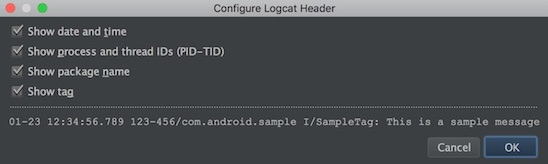

# android-logcat.tmLanguage

* Colorize log to let you focus on the important things.  
* Above all, colors make debugging more efficient and make me happy.
* It supports all header configurations in Android Studio logcat viewer.

## Usage

1. Copy the `.tmLanguage` and `.tmTheme` files to your `Packages/User`
2. <kbd>Ctrl</kbd>+<kbd>Shift</kbd>+<kbd>P</kbd>  (Mac: <kbd>Command</kbd>+<kbd>Shift</kbd>+<kbd>P</kbd>)
3. `ss logcat`
4. Select the logcat format
5. Enjoy

## Screenshots

* `Logcat Viewer in Android Studio`

* `Android log shown in Sublime`  

## TODO

* Use YAML syntax.
* Handle logs with multiple lines.
* Remove the dependency of '.tmTheme' file.

## License

MIT

## Credit

Thanks for the project: https://github.com/leesei/logcat.tmLanguage